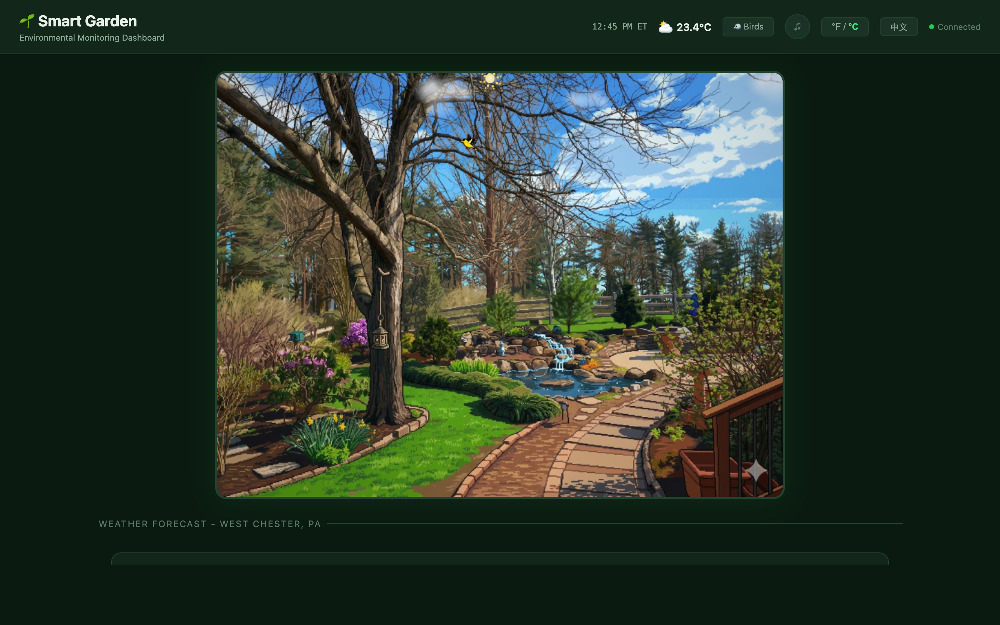

[English](#smart-garden) | [中文](#smart-garden-智慧花园)

---

# Smart Garden

A real-time IoT monitoring dashboard that integrates multiple smart home platforms with weather data and AI-powered bird detection into a unified web interface. Designed to run 24/7 on a Raspberry Pi 5 connected to a TV, with full bilingual (English/Chinese) support.



## Features

### SensorPush Environmental Monitoring
Real-time data from wireless SensorPush sensors including temperature, humidity, dew point, barometric pressure, and VPD (Vapor Pressure Deficit). Interactive historical charts with selectable time ranges (1H, 6H, 24H, 3D, 7D).

### Reolink Camera with HLS Streaming
Live RTSP-to-HLS video streaming from a Reolink RLC-811A camera monitoring a koi pond. Supports PTZ (Pan/Tilt/Zoom) control, snapshots, stable (sub-stream copy, 0% CPU) and HD (720p transcode) modes, with automatic reconnection and a latency watchdog.

### AI-Powered Bird Detection
BirdNET-based acoustic bird detection using a local microphone. Detected species are logged with timestamps and audio clips, then enriched with AI-generated descriptions via the Claude API. Includes a leaderboard, Bird of the Day (BOTD), a searchable field guide with swipe gestures, and species activity heatmaps.

### Tuya Smart Device Control
Integration with Tuya-compatible devices:
- **Smart Dual Water Timer** -- two independently controllable valves (flower basket & koi pond) with countdown timers and server-side auto-off
- **Water Leak Sensor** -- dual-probe pond alarm with event logging
- **CO Alarm** -- carbon monoxide monitoring

### Weather Integration
NWS (National Weather Service) forecast data including current conditions, hourly/daily forecast, and computed sunrise/sunset times.

### Water Level Monitoring
Camera-based computer vision water level detection for the koi pond, with a calibration UI for ROI (Region of Interest) selection.

### Animated Garden Visualization
Canvas-rendered 3D isometric garden scene with animated sprites, day/night cycle based on sunrise/sunset, and a built-in sprite editor.

### Bilingual Support
All pages support English and Chinese via URL prefix (`/cn/...`). The TV display defaults to Chinese with Celsius.

## Pages

| Route | Description |
|-------|-------------|
| `/` | Main dashboard -- weather, sensors, charts, water timer, bird notifications |
| `/tv` | 1080p TV display -- large fonts, no emoji (for Linux/RPi5), auto-reconnecting camera |
| `/koi` | Koi pond camera -- HLS stream, PTZ controls, valve controls, motion events |
| `/bird` | Bird detection -- leaderboard, Bird of the Day, field guide with swipe gestures |
| `/water` | Water level -- calibration ROI tool, level history |
| `/edit` | Garden editor -- 3D sprite editor (dev tool) |

All pages are also available in Chinese at `/cn/...` (e.g., `/cn/tv`, `/cn/bird`).

## Setup

### Prerequisites

- **Node.js** >= 18
- **FFmpeg** (for RTSP-to-HLS camera streaming)
- **Python 3** + BirdNET (for bird detection, optional)
- A **SensorPush** account with sensors
- A **Tuya IoT Platform** developer account
- A **Reolink** camera (optional, for live streaming)
- An **Anthropic API key** (optional, for AI bird descriptions)

### Installation

```bash
git clone https://github.com/quake0day/sensorpush-dashboard.git
cd sensorpush-dashboard
npm install
```

### Configuration

Create a `.env` file in the project root:

```bash
# ---- SensorPush ----
# Create an account at https://www.sensorpush.com
# These are your SensorPush app login credentials
SENSORPUSH_EMAIL=your-email@example.com
SENSORPUSH_PASSWORD=your-password

# ---- Tuya IoT Platform ----
# Create a project at https://platform.tuya.com
# Go to Cloud > Development > your project > Overview for these credentials
TUYA_ACCESS_ID=your-tuya-access-id
TUYA_ACCESS_SECRET=your-tuya-access-secret
TUYA_BASE_URL=https://openapi.tuyaus.com    # US data center, change for other regions

# ---- Reolink Camera (optional) ----
# Local IP address and credentials of your Reolink camera
REOLINK_IP=192.168.1.100
REOLINK_USER=admin
REOLINK_PASSWORD=your-camera-password

# ---- Anthropic / Claude API (optional) ----
# For AI-generated bird species descriptions in the field guide
# Get your key at https://console.anthropic.com
ANTHROPIC_API_KEY=sk-ant-...

# ---- Server ----
PORT=3088
```

### Running

```bash
# Start the server
node server.js

# Or use npm
npm start
```

The dashboard will be available at `http://localhost:3088`.

### Production Deployment (Raspberry Pi)

The project includes systemd service files for auto-start and auto-deploy:

```bash
# Auto-deploy checks GitHub every 60 seconds for new commits
sudo systemctl enable sensorpush-autodeploy.timer
sudo systemctl start sensorpush-autodeploy.timer

# Main service
sudo systemctl enable sensorpush-dashboard
sudo systemctl start sensorpush-dashboard
```

## API Endpoints

### Sensors
| Endpoint | Description |
|----------|-------------|
| `GET /api/sensors` | List all SensorPush sensors |
| `POST /api/samples` | Get historical sensor data |
| `GET /api/gateways` | List SensorPush gateways |

### Weather
| Endpoint | Description |
|----------|-------------|
| `GET /api/weather` | NWS forecast + sunrise/sunset |

### Camera
| Endpoint | Description |
|----------|-------------|
| `GET /api/camera/status` | HLS stream status |
| `POST /api/camera/stream` | Switch quality (stable/hd) |
| `POST /api/camera/restart` | Restart HLS stream |
| `GET /api/camera/snap` | Take a snapshot |
| `POST /api/camera/ptz` | PTZ control |

### Water Timer
| Endpoint | Description |
|----------|-------------|
| `GET /api/timer/status` | Valve status and countdowns |
| `POST /api/timer/valve` | Control valve (on/off/countdown) |

### Bird Detection
| Endpoint | Description |
|----------|-------------|
| `GET /api/birds/latest` | Recent detections |
| `GET /api/birds/daily/:date` | Detections for a specific date |
| `GET /api/birds/stats` | Species statistics |
| `GET /api/birds/botd` | Bird of the Day |
| `GET /api/birds/detail/:name` | AI-generated species detail |
| `GET /api/birds/image/:name` | AI-generated species image |

### Water Level
| Endpoint | Description |
|----------|-------------|
| `GET /api/water/current` | Current water level reading |
| `GET /api/water/readings` | Historical readings |
| `GET /api/water/calibration` | Get calibration config |
| `POST /api/water/calibration` | Set calibration ROI |

## Tech Stack

- **Backend**: Node.js + Express
- **Frontend**: Vanilla JS + HTML/CSS (no build step)
- **Charts**: Chart.js
- **Streaming**: FFmpeg (RTSP to HLS)
- **Bird Detection**: BirdNET (Python) + Claude API
- **APIs**: SensorPush, Tuya Cloud, NWS, Anthropic

## License

MIT

---

# Smart Garden 智慧花园

一个实时物联网监控面板，将多个智能家居平台与天气数据和 AI 鸟类识别整合到统一的 Web 界面中。可在树莓派 5 上 24/7 运行并连接电视显示，完整支持中英双语。


## 功能特性

### SensorPush 环境监测
通过无线 SensorPush 传感器实时采集温度、湿度、露点、气压和 VPD（蒸气压差）数据。支持交互式历史图表，可选择时间范围（1小时、6小时、24小时、3天、7天）。

### Reolink 摄像头 HLS 直播
通过 Reolink RLC-811A 摄像头对锦鲤池进行 RTSP 转 HLS 实时视频推流。支持 PTZ 云台控制、快照抓拍，提供稳定模式（子码流直传，0% CPU 占用）和高清模式（720p 转码），具备自动重连和延迟看门狗机制。

### AI 鸟类识别
基于 BirdNET 的声学鸟类检测，通过本地麦克风采集音频。检测到的鸟种会记录时间戳和音频片段，并通过 Claude API 生成 AI 描述。包含排行榜、每日之鸟（BOTD）、支持滑动手势的鸟类图鉴，以及物种活动热力图。

### 涂鸦（Tuya）智能设备控制
集成涂鸦兼容设备：
- **智能双路浇水定时器** -- 两个独立控制的阀门（花篮和锦鲤池），支持倒计时和服务端自动关闭
- **水浸传感器** -- 双探头池塘报警，带事件日志
- **一氧化碳报警器** -- CO 浓度监测

### 天气集成
NWS（美国国家气象局）天气预报数据，包括当前天气状况、逐时/逐日预报，以及计算的日出日落时间。

### 水位监测
基于摄像头的计算机视觉水位检测，用于监控锦鲤池水位，配有 ROI（感兴趣区域）校准界面。

### 动态花园可视化
Canvas 渲染的 3D 等距花园场景，带有动画精灵图、基于日出日落的昼夜切换，以及内置精灵图编辑器。

### 中英双语支持
所有页面通过 URL 前缀 (`/cn/...`) 支持中英文切换。电视显示页面默认使用中文和摄氏度。

## 页面

| 路由 | 说明 |
|------|------|
| `/` | 主面板 -- 天气、传感器、图表、浇水定时器、鸟类通知 |
| `/tv` | 1080p 电视显示 -- 大字体、无 emoji（适配 Linux/RPi5）、摄像头自动重连 |
| `/koi` | 锦鲤池摄像头 -- HLS 直播、云台控制、阀门控制、移动侦测事件 |
| `/bird` | 鸟类识别 -- 排行榜、每日之鸟、支持滑动手势的鸟类图鉴 |
| `/water` | 水位监测 -- ROI 校准工具、水位历史 |
| `/edit` | 花园编辑器 -- 3D 精灵图编辑器（开发工具） |

所有页面均可通过 `/cn/...` 访问中文版（如 `/cn/tv`、`/cn/bird`）。

## 安装部署

### 环境要求

- **Node.js** >= 18
- **FFmpeg**（用于 RTSP 转 HLS 摄像头推流）
- **Python 3** + BirdNET（用于鸟类检测，可选）
- **SensorPush** 账户及传感器
- **涂鸦 IoT 开放平台**开发者账户
- **Reolink** 摄像头（可选，用于视频直播）
- **Anthropic API 密钥**（可选，用于 AI 鸟类描述）

### 安装

```bash
git clone https://github.com/quake0day/sensorpush-dashboard.git
cd sensorpush-dashboard
npm install
```

### 配置

在项目根目录创建 `.env` 文件：

```bash
# ---- SensorPush ----
# 在 https://www.sensorpush.com 注册账户
# 填写你的 SensorPush 登录凭据
SENSORPUSH_EMAIL=your-email@example.com
SENSORPUSH_PASSWORD=your-password

# ---- 涂鸦 IoT 开放平台 ----
# 在 https://platform.tuya.com 创建项目
# 进入 云开发 > 你的项目 > 概览 获取以下凭据
TUYA_ACCESS_ID=your-tuya-access-id
TUYA_ACCESS_SECRET=your-tuya-access-secret
TUYA_BASE_URL=https://openapi.tuyaus.com    # 美国数据中心，其他地区请更换

# ---- Reolink 摄像头（可选）----
# 摄像头的局域网 IP 和登录凭据
REOLINK_IP=192.168.1.100
REOLINK_USER=admin
REOLINK_PASSWORD=your-camera-password

# ---- Anthropic / Claude API（可选）----
# 用于在鸟类图鉴中生成 AI 物种描述
# 在 https://console.anthropic.com 获取密钥
ANTHROPIC_API_KEY=sk-ant-...

# ---- 服务器 ----
PORT=3088
```

### 启动

```bash
# 启动服务
node server.js

# 或使用 npm
npm start
```

启动后访问 `http://localhost:3088` 即可打开面板。

### 生产环境部署（树莓派）

项目包含 systemd 服务文件，支持开机自启和自动部署：

```bash
# 自动部署：每 60 秒检查 GitHub 是否有新提交
sudo systemctl enable sensorpush-autodeploy.timer
sudo systemctl start sensorpush-autodeploy.timer

# 主服务
sudo systemctl enable sensorpush-dashboard
sudo systemctl start sensorpush-dashboard
```

## API 接口

### 传感器
| 接口 | 说明 |
|------|------|
| `GET /api/sensors` | 列出所有 SensorPush 传感器 |
| `POST /api/samples` | 获取传感器历史数据 |
| `GET /api/gateways` | 列出 SensorPush 网关 |

### 天气
| 接口 | 说明 |
|------|------|
| `GET /api/weather` | NWS 天气预报 + 日出日落 |

### 摄像头
| 接口 | 说明 |
|------|------|
| `GET /api/camera/status` | HLS 推流状态 |
| `POST /api/camera/stream` | 切换画质（stable/hd） |
| `POST /api/camera/restart` | 重启 HLS 推流 |
| `GET /api/camera/snap` | 抓拍快照 |
| `POST /api/camera/ptz` | 云台控制 |

### 浇水定时器
| 接口 | 说明 |
|------|------|
| `GET /api/timer/status` | 阀门状态和倒计时 |
| `POST /api/timer/valve` | 控制阀门（开/关/倒计时） |

### 鸟类识别
| 接口 | 说明 |
|------|------|
| `GET /api/birds/latest` | 最近检测记录 |
| `GET /api/birds/daily/:date` | 指定日期的检测记录 |
| `GET /api/birds/stats` | 物种统计 |
| `GET /api/birds/botd` | 每日之鸟 |
| `GET /api/birds/detail/:name` | AI 生成的物种详情 |
| `GET /api/birds/image/:name` | AI 生成的物种图片 |

### 水位
| 接口 | 说明 |
|------|------|
| `GET /api/water/current` | 当前水位读数 |
| `GET /api/water/readings` | 历史水位数据 |
| `GET /api/water/calibration` | 获取校准配置 |
| `POST /api/water/calibration` | 设置校准 ROI |

## 技术栈

- **后端**: Node.js + Express
- **前端**: 原生 JS + HTML/CSS（无需构建）
- **图表**: Chart.js
- **视频推流**: FFmpeg（RTSP 转 HLS）
- **鸟类检测**: BirdNET (Python) + Claude API
- **API 集成**: SensorPush、涂鸦云、NWS、Anthropic

## 许可证

MIT
